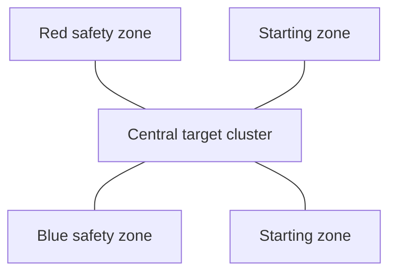

# Competition Task Context

This repository corresponds to the intelligent rescue event in the "Intelligence+" track of the 2025 China College Student Engineering Practice and Innovation Ability Competition.

本文件用于说明赛题背景，帮助读者理解机器人控制代码、执行机构和机械结构为什么这样组织。它不是官方规则替代文本；正式比赛仍以组委会发布文件和现场说明为准。

Referenced rule documents:

- `附件2-1-2025年中国大学生工创大赛智能+赛道命题与运行(发布).pdf`
- `附件2-2-2025年中国大学生工创大赛智能+赛道评分与规则(发布).pdf`
- `附件2：智能+赛道命题规则.pdf`
- `2025年中国大学生工程实践与创新能力大智能+赛道竞赛过程解析.pdf`

## Task Summary

The intelligent rescue task asks each team to design and build one rescue robot. Two teams compete in the same field at the same time. Each robot starts from its own starting zone, collects rescue targets from the field, and transfers as many valid targets as possible into its own safety zone.

智能救援赛项要求参赛队自主设计并制作一台救援机器人。比赛中两队机器人同场运行，在保护自身、避免违规碰撞和干扰的前提下，把尽可能多的救援目标转移到本方安全区。

The task is not just "drive to a ball". It combines:

- perception: identifying target color and approximate position;
- motion: fast movement, turning, approaching, retreating, and obstacle handling;
- collection: gathering targets without using a robotic-arm grasping method;
- transfer and release: carrying or guiding targets into the safety zone;
- robustness: surviving contact, collision, overturning risk, and repeated field resets;
- mode control: autonomous start, then optional remote control after the required autonomous condition is met.

## Field And Targets

| Item | Rule context |
|---|---|
| Field | About `2400 mm x 2400 mm`, surrounded by protective walls. |
| Zones | Each side has a starting zone and a rectangular safety zone. Red/blue sides are decided by draw. |
| Safety-zone fence | The fence cross-section is triangular so targets can be pushed in from outside and are less likely to roll out. |
| Target types | Ordinary targets, core targets, and dangerous targets. Ordinary targets belong to red or blue sides; core and dangerous targets are shared targets. |
| Preliminary targets | 14 balls, about `phi 40 mm` and `3-10 g`: 4 red ordinary, 4 blue ordinary, 4 black core, and 2 yellow dangerous targets. |
| Final targets | Quantity, shape, color, weight, size, and placement are announced on site. Rule limits allow abstract geometry up to about `140 mm` diameter and `800 g`. |

The preliminary field can be understood as this task shape:

## Match Flow

1. Teams draw field, side, target color, and match order.
2. Each team can send up to two members to debug the robot on field. The preliminary rule gives a 3-minute debugging window.
3. After debugging, the robot is placed in its starting zone and may no longer be touched.
4. The robot must start autonomously and leave the starting zone within the required start window.
5. The first completed target must be an ordinary target moved autonomously into the team's own safety zone.
6. After that condition is satisfied, the robot may continue collecting ordinary, core, and dangerous targets. Remote control can be used, but using wireless remote control changes the run mode to autonomous plus remote.
7. The robot may transfer any number and type of targets at once.
8. The robot must not enter the opponent's safety zone. If two robots touch for more than 10 seconds, they are separated and returned to their starting zones while match timing continues.
9. The preliminary match run time is 3 minutes. The match ends when time expires or all targets have been moved into safety zones.

## Scoring Logic

The scoring rules explain several software and mechanical design choices:

- Autonomous transfer is heavily rewarded: one target completed in fully autonomous mode is worth four times the corresponding autonomous plus remote score.
- In autonomous plus remote mode, switching to remote control before autonomously completing one ordinary target makes the score invalid.
- In autonomous plus remote mode, ordinary targets are worth 5 points, core targets 10 points, and dangerous targets 15 points.
- Moving an opponent's ordinary target into your own safety zone causes a deduction. Moving your own target into the opponent's safety zone gives the opponent credit.
- Targets ejected from the safety zone do not score.
- Entering or pressing onto the opponent's safety zone causes deductions.
- Malicious attack can make the round score zero, especially when the opponent has not touched any rescue target, is overturned or unrecovered, or all targets have already been moved.

At the event level, the preliminary score combines task documentation, creative design, and on-site preliminary performance. The final score combines the on-site innovation practice session and the on-site final run. This is why the repository keeps both software/control notes and mechanical CAD artifacts: the project was judged as an integrated engineering system, not only as source code.

## Engineering Constraints

| Constraint | Design implication |
|---|---|
| Maximum weight about `1.5 kg` | The mechanism and battery layout need to stay compact. |
| Maximum starting footprint about `300 mm x 300 mm`, height about `200 mm` | Collection and release mechanisms must fold or fit inside the starting envelope. |
| No component replacement during a match | Code and mechanism must tolerate repeated runs without mid-match repair. |
| Same-field collision | Chassis, mounts, wiring, and sensors need basic impact protection. |
| No dangerous mechanisms, electronic interference, strong light, laser, smoke, or exposed sharp/high-speed structures | Actuation must stay within competition safety boundaries. |
| No robotic-arm grasping for target collection | The design favors intake, rolling, guiding, storing, and releasing targets rather than arm-based grasping. |

## How This Maps To The Repository

| Repository part | Competition role |
|---|---|
| `src/robot_control.py` | Main Raspberry Pi control script: GPIO, PWM, I2C gyroscope, serial/gamepad input, motor control, intake/release actuators, autonomous/manual mode transition, and integration debugging. |
| Vision/OpenCV code in `src/robot_control.py` | Camera-based target recognition and target-position estimation used by the autonomous stage. The vision/perception contribution was mainly written by 苏玉轩. |
| Intake, fan, roller, and release logic | Supports collecting small rescue balls, holding them, and releasing them toward the safety zone. |
| Red/blue side switch and color thresholds | Supports side draw and target-color differences between red and blue teams. |
| `hardware/cad/` | Mechanical parts related to the collection/release path and robot body. Mechanical fabrication and bring-up were mainly handled by 王朔 and 张家毓. |
| `docs/system-architecture.md` | Higher-level control and data-flow notes. |

In short, the code is a competition robot integration script rather than a desktop demo. Its structure reflects the pressure of a three-minute field run: initialize hardware quickly, complete the required autonomous ordinary-target transfer, then keep the robot controllable and mechanically recoverable for the rest of the match.
