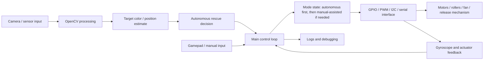
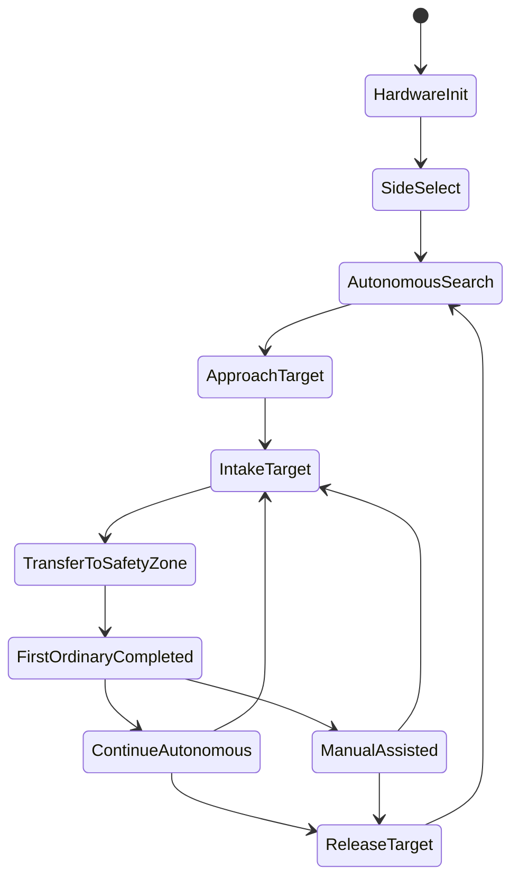

# System Architecture

## Task-Driven Control Flow

The rescue rules shape the control architecture:

1. The robot must start autonomously.
2. The first valid target must be an ordinary target moved into the team's own safety zone.
3. After that, the operator can use remote/manual assistance, but the run mode is then counted as autonomous plus remote.
4. The robot needs fast recovery because the match is short, the field is shared by two robots, and contact can force a reset to the starting zone.

## Notes

- Camera and OpenCV processing provide the main perception input. This vision/perception code was mainly written by 苏玉轩.
- The downstream non-vision software, including decision/control flow, GPIO, I2C, serial, actuator interfaces, manual/automatic modes, and integration debugging, was mainly written by 田秉卓.
- Mechanical structure fabrication and mechanism bring-up were mainly handled by 王朔 and 张家毓.
- The hardware-bound script should be tested on the robot platform. This repository keeps the original integrated control script rather than adding desktop-only demo modules.
- The intake, fan, roller, and release code exists because the task rewards moving small rescue targets into a safety zone without using robotic-arm grasping. The red/blue side switch and color thresholds reflect the random side draw and different target ownership during matches.
