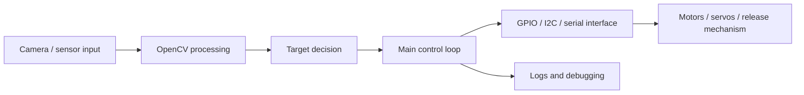

# System Architecture

## Notes

- Camera and OpenCV processing provide the main perception input.
- GPIO, I2C, serial, and actuator libraries connect the Raspberry Pi control program to motors, servos, and release mechanisms.
- The hardware-bound script should be tested on the robot platform, while the small Python demos in `src/` are only for understanding command flow on a desktop.
