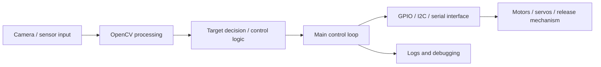

# System Architecture

## Notes

- Camera and OpenCV processing provide the main perception input. This vision/perception code was mainly written by 苏玉轩.
- The downstream non-vision software, including decision/control flow, GPIO, I2C, serial, actuator interfaces, manual/automatic modes, and integration debugging, was mainly written by 田秉卓.
- Mechanical structure fabrication and mechanism bring-up were mainly handled by 王朔 and 张家毓.
- The hardware-bound script should be tested on the robot platform, while the small Python demos in `src/` are only for understanding command flow on a desktop.
