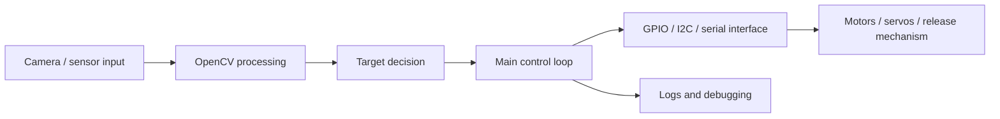

# System Architecture Draft

## ROS 2 Mapping Idea

- camera pipeline -> image topic
- target decision -> target-state topic or service
- main loop -> control node
- actuator commands -> actuator interface
- logs -> observability and fault-recovery notes

